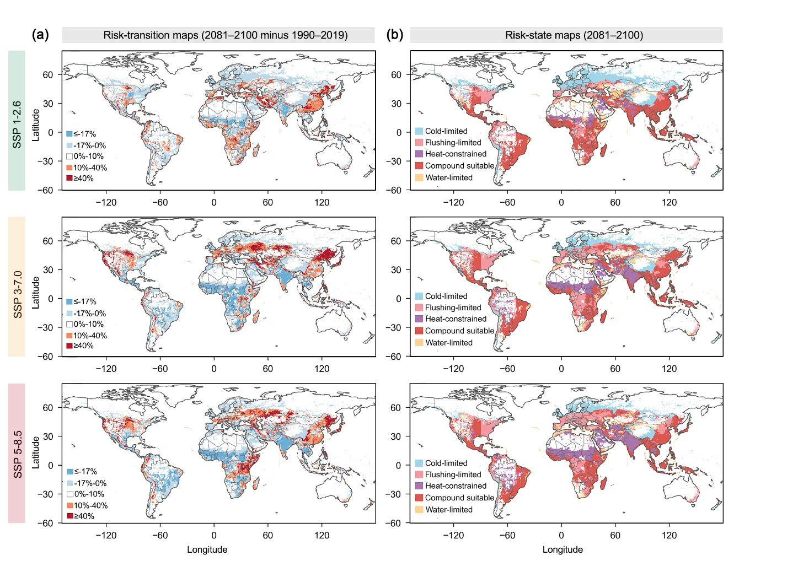
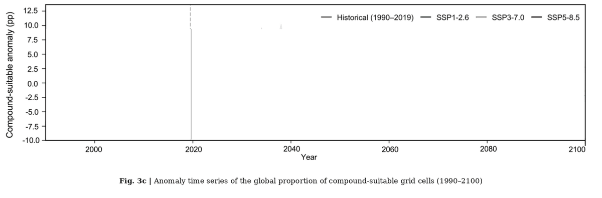

# Compound Heat–Flood Thresholds Reshape Global *Aedes*-borne Arboviral Risk Frontiers 🦟🌡️🌊

[](LICENSE)

---



<p align="center"><b>Figure 3a–b.</b> Future reorganization of five thermal–flood climate-risk states, 2081–2100 relative to 1990–2019.</p>

---

## Overview

This repository accompanies the manuscript *Compound heat-flood thresholds reshape global Aedes-borne arboviral risk frontiers*. It provides the Habitat–Flood Flexible Model (HFFM) code used to adjust dengue, chikungunya and Zika occurrence records for surveillance bias, estimate nonlinear thermal–flood responses, classify five climate-risk states, and project probability-weighted population exposure from 1990 to 2100.

Processed analysis-ready data are archived separately on Zenodo. This repository contains code, method notes and visualization assets.

## Paper

Compound heat–flood thresholds reshape global *Aedes*-borne arboviral risk frontiers. Manuscript in submission.

## Dataset

Processed 0.5-degree HFFM inputs and outputs. Zenodo. [https://doi.org/10.5281/zenodo.21987231](https://doi.org/10.5281/zenodo.21987231)

## Code

[JinRuii/global-aedes-heat-flood-hffm](https://github.com/JinRuii/global-aedes-heat-flood-hffm)

### Future change in the global compound-suitable share

<p align="center">
  
</p>

<p align="center"><b>Figure 3c.</b> Annual anomaly in the global share of compound-suitable grid cells, 1990–2100, under SSP1-2.6, SSP3-7.0 and SSP5-8.5.</p>

## What This Repository Provides

- Google Earth Engine scripts for historical thermal suitability and pluvial flood indicators
- Python scripts for surveillance-bias adjustment, flood activation, five-state classification and Shapley exposure decomposition
- R scripts for HFFM fitting, three-way interactions and future prediction
- Method notes mapped to the manuscript
- Figure assets used in this README

---

## Table of Contents

- [Overview](#overview)
- [Paper](#paper)
- [Dataset](#dataset)
- [Code](#code)
- [What This Repository Provides](#what-this-repository-provides)
- [Analysis in Brief](#analysis-in-brief)
- [Project Structure](#project-structure)
- [Requirements](#requirements)
- [Quick Start](#quick-start)
- [Mapping to the Manuscript](#mapping-to-the-manuscript)
- [Licence](#licence)
- [Citation](#citation)

---

## Analysis in Brief

| Item | Description |
|---|---|
| Response | Annual 0.5° occurrence of dengue, chikungunya or Zika (DCZ), 1990–2019 |
| Climate drivers | Thermal suitability index (TSI), flood activation index (FAI), overheat suppression days (OHD) |
| Model | Habitat–Flood Flexible Model: binomial GAM with a tensor-product smooth of TSI and FAI, plus a surveillance offset |
| Risk states | cold-limited, heat-constrained, water-limited, flushing-limited, compound-suitable |
| Futures | SSP1-2.6, SSP3-7.0 and SSP5-8.5, 2020–2100 |
| Grid | 33,313 land cells, 0.5°, EPSG:4326 |

## Project Structure

```text
global-aedes-heat-flood-hffm/
├── gee/                      # historical TSI, OHD, R95d and Rx5day
├── python/                   # surveillance offset, FAI, states, exposure
├── r/                        # HFFM fit, interactions, future prediction
├── docs/                     # method notes and figure assets
│   ├── DATA_AND_METHODS.md
│   └── figures/
├── environment.yml
├── requirements.txt
├── LICENSE
└── README.md
```

## Requirements

- Google Earth Engine account for `gee/`
- Python 3.10+ (`environment.yml` or `requirements.txt`)
- R 4.3+ with `mgcv`, `data.table` and `ggplot2`

## Quick Start

Download the Zenodo deposit after publication and point the commands below to its `data/` folder.

Minimum files:

- `data/01_historical_panel/Panel_with_IPCC_Region_FINAL.csv`
- `data/04_thresholds/region_flood_thresholds_final.csv`
- `data/02_future_projections/inputs/step1_SSP*_prepared.csv`

```bash
# 1. Historical climate indicators, if rebuilding from ERA5-Land
# gee/01_thermal_suitability.js
# gee/02_pluvial_indicators.js

# 2. Surveillance offset
python python/01_surveillance_offset.py --input PANEL.csv --output PANEL_with_offset.csv

# 3. Historical flood activation index
python python/02_flood_activation_index.py --historical PANEL_with_offset.csv --output PANEL_with_FAI.csv --params-out outputs/fai_params.json

# 4. Fit HFFM
Rscript r/01_fit_hffm.R PANEL_with_FAI.csv outputs/hffm_model.rds

# 5. Optional three-way interactions
Rscript r/02_three_way_interactions.R PANEL_with_FAI.csv outputs/interactions

# 6. Future probabilities
Rscript r/03_predict_future.R outputs/hffm_model.rds step1_SSP1_prepared.csv outputs/step2_SSP1_with_prob.csv

# 7. Five-state classification
python python/05_five_state_classification.py --input outputs/step2_SSP1_with_prob.csv --thresholds region_flood_thresholds_final.csv --output outputs/states_SSP1.csv

# 8. Exposure decomposition
python python/06_shapley_exposure.py --pred decomp_pred_SSP1.csv --states outputs/states_SSP1.csv --output outputs/exposure_SSP1.csv
```

Raw ERA5-Land, GloFAS, NEX-GDDP-CMIP6, ISIMIP and H08 archives are not stored here. See [`docs/DATA_AND_METHODS.md`](docs/DATA_AND_METHODS.md).

## Mapping to the Manuscript

| Manuscript item | Script |
|---|---|
| Fig. 1 | `python/01_surveillance_offset.py`, `r/01_fit_hffm.R` |
| Fig. 2 | `r/01_fit_hffm.R`, `r/02_three_way_interactions.R`, `python/05_five_state_classification.py` |
| Fig. 3 | `r/03_predict_future.R`, `python/05_five_state_classification.py` |
| Fig. 4 and Table 1 | `python/06_shapley_exposure.py` |
| Table 2 | counterfactual columns in `decomp_data_SSP*.csv` / `decomp_pred_SSP*.csv` |

Classification thresholds: TSI 77.8 and 236.1; global FAI water threshold 0.24; uncalibrated regions use `x_r = 0.407`. File tags SSP1 / SSP3 / SSP5 correspond to SSP1-2.6 / SSP3-7.0 / SSP5-8.5.

## Licence

This repository is released under the [MIT License](LICENSE).

## Citation

If you use the code, please cite the accompanying manuscript and the Zenodo data record:

```text
Processed data for Compound heat-flood thresholds reshape global Aedes-borne arboviral risk frontiers (2026). Zenodo. https://doi.org/10.5281/zenodo.21987231
```
